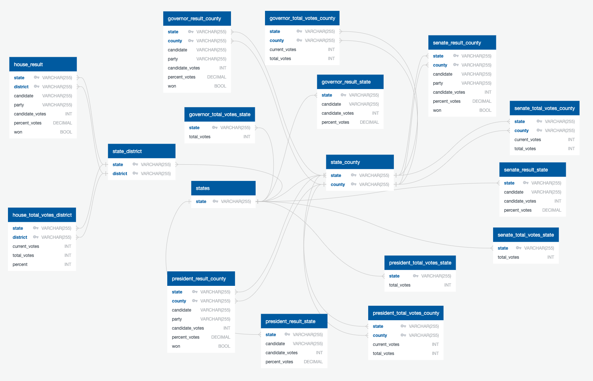

# U.S. Election 2020 

## Project Proposal

The ETL process will be based on 2020 election result data for major races; Governors, House of Representatives, President, and Senate, across the U.S. GitHub will be used as a base of collaboration operations and Jupyter Notebook will be accompanied to clean the csv files and create new composite tables using Pandas, and eventually store our cleaned tables in PostgreSQL.

Note: All ETL processes accompanied by Jupyter Notebook and PostgreSQL. 

Click here to view the data management in [Jupyter Notebook](https://nbviewer.jupyter.org/github/LeeProut/ETL-project/blob/main/election2020.ipynb)
Click here to view the data management in [PostgreSQL](schemas.sql)

## Extract

- **Source:** https://www.kaggle.com/unanimad/us-election-2020
- **Format:** CSV
- **No. of datasets:** 11 

- Using Pandas to read in CSV files to perform other following processes.

    * For example

            # File paths
            gov_cn_path = 'Resources/governors_county.csv'
            gov_cand_path = 'Resources/governors_county_candidate.csv'
            gov_ste_path = 'Resources/governors_state.csv'
        
            # Read csv files
            gov_cn_df = pd.read_csv(gov_cn_path)
            gov_cand_df = pd.read_csv(gov_cand_path)
            gov_ste_df = pd.read_csv(gov_ste_path)
        

## Transform

- Used Pandas Data Frame was created for each dataset from the previous method (extract).

- Rename function (`df.rename(columns={})`) was applied to rename the columns for “votes” or “total_votes” to “candidate_votes” for the purpose of clarity and consistency.

- Calculated and assigned a column for each candidate’s percentage of the total vote, both by counties and by states. 

- For the house representatives' race, the datasets did not initially contain columns for `state`. For the purpose of consistency, the datasets were added to the column using the numpy function `.select`. Also, removed all the *nan* value which was found in `state` column. As the observation of dataset, removing *nan* would not be resulting in the lack of information of the dataset.

- For the senate's race, the datasets did not initially contain columns for `won`. For the purpose of consistency and further analysis, the dataset was added to the column using the `.transform` and `.iloc` functions. 

- Reordered the columns for each dataset to fit a consistent and logical pattern. 

## Load

- Created database diagram and PostgreSQL query via [QuickDatabase](https://app.quickdatabasediagrams.com/#/d/Vj5DcU)

  

- Created a **SQL database** in Postgres (relational database), which contains tables for each of the data frames extracted from the previous step.

    * The composite key as the primary key between **state and county** will be applied to tables which contain column `state` and `county`, due to the duplication of county names.
    * The composite key as the primary key between **state and district** will be applied to tables which contain column `state` and `district`, due to the duplication of district names.

- Created the master data for states, state-county and state-district

    * The purpose of creation is the data in these tables will be used as a foreign key for the tables that contain states, counties and districts.
    * Table state_county and state_district will use the state table for state column as the foreign key.
    
- Created the following tables for the President, Governor, and Senate races: 

    * Election result by county: To analyze the win-lose possibility by county
    * Election result by state: To compare the win-lose possibility with election result by county
    * Election’s total votes by county: To keep the record of how many people vote compared to county population 
    * Election’s total votes by state: To keep the record of how many people vote compared to state population

- Created the following tables for the House race: 

    * Election result by district: To analyze the win-lose possibility by county
    * Election’s total votes by district: To keep the record of how many people vote compared to district population

- Accompanied by **Jupyter Notebook** and loaded each data frame into their respective tables in the database.

*Note:* In a limited timeframe, population data will be for further ETL processes. 

---

Contributors

© Atcharaporn Puccini: b.atcharaporn@gmail.com
© Shay O'Connell: shay.oconnell7@gmail.com
© Akilah Hunte: ahunt173@gmail.com
© Lee Prout: wleeprout@gmail.com
